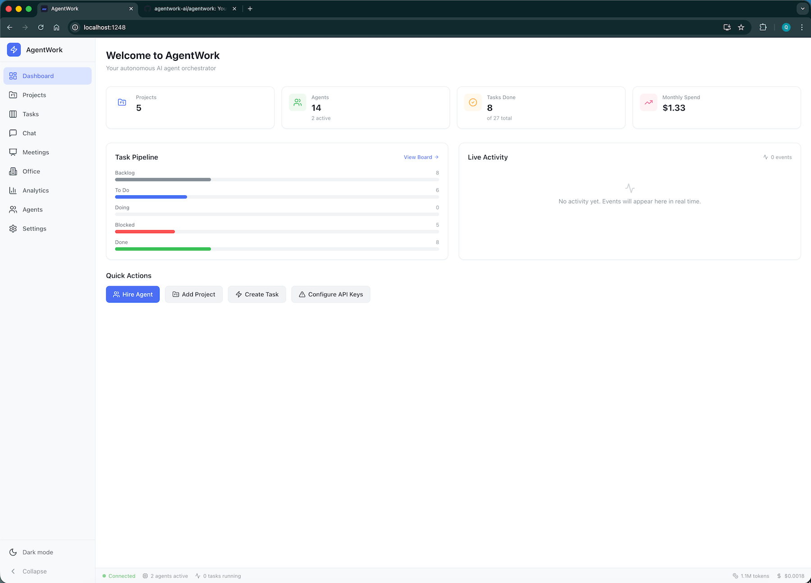
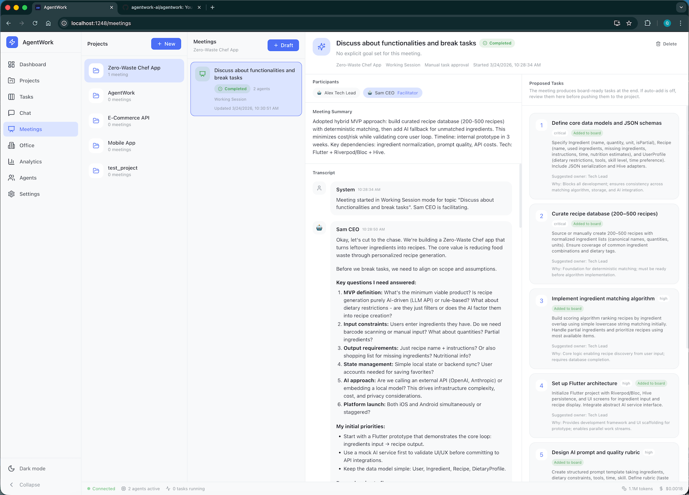

# AgentWork — Autonomous AI Workbench

[](https://github.com/agentwork-ai/agentwork) [](https://www.npmjs.com/package/agentwork) [](LICENSE)

Autonomous AI agent orchestration platform for software teams. Hire role-based agents, give them structured workspace memory, let them collaborate in direct chat, mention-based group chat, and autonomous meetings, then turn decisions into project tasks and shipped code.

Website: [agentwork.sh](https://agentwork.sh)

<table>
  <tr>
    <td align="center" valign="top"><strong>Dashboard</strong><br></td>
    <td align="center" valign="top"><strong>Agent Planning Meeting</strong><br></td>
  </tr>
  <tr>
    <td align="center" valign="top"><strong>Kanban Board</strong><br></td>
    <td align="center" valign="top"><strong>Task Detail</strong><br></td>
  </tr>
  <tr>
    <td align="center" valign="top"><strong>Agent Manager</strong><br></td>
    <td align="center" valign="top"><strong>Agent Chat</strong><br></td>
  </tr>
</table>

## Installation

Requires **Node.js 18+**.

### One-liner install (macOS/Linux)

```bash
curl -fsSL https://agentwork.sh/install.sh | bash
```

The installer bootstraps Node.js if needed, installs the latest `agentwork`, starts the daemon, and prints the local dashboard URL.

### Option 2: npm

```bash
npm install -g agentwork
agentwork start
```

### Option 3: From source

```bash
git clone https://github.com/agentwork-ai/agentwork.git
cd agentwork
npm install && npm run build && npm link
agentwork start
```

Open **http://localhost:1248** — the onboarding wizard will guide you through setup.

## Why AgentWork Is Strong

- **Persistent agent workspaces** — Every hired agent gets a real workspace with `AGENTS.md`, `ROLE.md`, `SOUL.md`, `IDENTITY.md`, `TOOLS.md`, `USER.md`, `HEARTBEAT.md`, `MEMORY.md`, and daily notes under `memory/YYYY-MM-DD.md`
- **Planning-to-delivery loop** — Run planning meetings between agents, generate scoped task lists, send them to the Kanban board, and execute them with autonomous agents
- **Mixed runtime support** — Run agents through API models, Claude CLI, Codex CLI, or provider-auth/OAuth-backed flows from one dashboard
- **Built for software organizations** — Use built-in leadership and delivery roles, project templates, project manager and main developer defaults, project docs, git automation, and project-aware task execution

## Features

### Agent System
- **Structured Workspace Files** — Agents use `AGENTS.md`, `ROLE.md`, `SOUL.md`, `IDENTITY.md`, `TOOLS.md`, `USER.md`, `HEARTBEAT.md`, `MEMORY.md`, and daily memory notes
- **22 Built-In Software Roles** — Includes Assistant, CEO, CTO, Product Manager, Project Manager, Business Analyst, Engineering Manager, Tech Lead, Frontend/Backend/Full Stack/Mobile Developer, QA, UI/UX, DevOps, Security, Data, ML, Technical Writer, and more
- **Role-Specific `ROLE.md`** — Every agent gets a dedicated role contract describing strengths, responsibilities, and expected behavior for that role
- **Agent Types** — Smart Agents use the full workspace, Worker Agents use only `ROLE.md` + memory, and CLI Agents skip workspace markdown files
- **OAuth / Provider Auth Agents** — Hire agents that use stored provider auth from Settings, including Anthropic setup-token, Gemini CLI OAuth, and Codex OAuth, in addition to API key and CLI-auth agents
- **Multi-Agent** — Hire agents with distinct roles, models, auth methods, and persistent memory
- **Agent Cloning** — Clone an agent's full configuration and workspace with one click
- **Per-Agent Tool Restrictions** — Whitelist which tools each agent can use
- **Streaming Chat** — Token-by-token streaming responses via Socket.io
- **Multi-Model Fallback** — Automatic fallback to secondary model on API failure
- **Context Window Management** — Auto-prunes conversation history to prevent truncation
- **Vision / Image Support** — Agents can analyze images via the `read_image` tool
- **Self-Improving Prompts** — Track success/failure rates with prompt improvement suggestions
- **Recurring Background Work** — `HEARTBEAT.md` acts as the live checklist for cron-style recurring tasks

### Collaboration And Planning
- **Direct Agent Chat** — Talk to agents one-on-one with streaming responses and memory-aware context
- **Group Chat Rooms** — Create multi-agent rooms, mention agents with `@name`, get mention autocomplete, and let only the mentioned agents respond
- **Autonomous Meetings** — Create topic-driven meetings for a project, invite agents, choose depth (`Rapid Alignment`, `Working Session`, `Deep Dive`), and let agents discuss without user participation
- **Task Generation From Meetings** — Meetings produce actionable task lists that can be auto-added to the project board or held for user confirmation
- **Facilitator-Aware Planning** — Leadership roles like CEO, Project Manager, Product Manager, and Business Analyst naturally drive planning and breakdown discussions

### Task Management And Delivery
- **5-Column Kanban** — Drag tasks to "Doing" and agents execute autonomously
- **Flow Tasks** — Sequential or parallel multi-step workflows across agents
- **Task Dependencies** — DAG-based execution — tasks wait for dependencies to complete
- **Sub-Tasks** — Nested tasks with parent-child relationships
- **Task Templates** — Save and reuse task blueprints
- **Task Labels/Tags** — Free-form tagging for filtering and grouping
- **Bulk Operations** — Multi-select for bulk status change, assign, or delete
- **Priority Queue** — Auto-start next highest-priority task when one finishes
- **Task Scheduling** — One-shot timestamps and recurring cron expressions
- **Retry Blocked Tasks** — Edit description and one-click retry
- **Task Comments** — Discussion threads separate from execution logs
- **Swimlanes** — Group Kanban by agent, project, or priority
- **Time Estimates & SLA** — Track estimated vs actual execution duration

### Project Context
- **Project Templates** — Generate `PROJECT.md` from built-in templates: Generic, iOS App, Android App, Flutter App, React Native App, Python App, Node API / Service, Next.js Web App, Web Frontend, and Go Service
- **Project Manager + Main Developer Fields** — Projects can define a planning owner and a default implementation owner
- **Smart Task Defaults** — New tasks default to the project's Main Developer; meeting-generated tasks fall back to the Project Manager when no owner is suggested
- **Project Explorer + Search** — Browse files, search code, inspect diffs, and edit inline from the dashboard
- **Project-Aware Context** — `PROJECT.md` is used as shared project memory for tasks, chat, worker agents, and CLI agents when relevant

### Git Automation (enabled by default)
- **Auto Branch** — Creates `agentwork/<task-slug>` branch before each task
- **Auto Sync** — Pulls latest from main before starting, auto-resolves conflicts
- **Auto Commit + PR** — Stages, commits, pushes, and opens PR via `gh` CLI
- **Auto Merge** — Squash-merges to main (via PR or local merge as fallback)
- **Auto Init** — Initializes git repo for projects that don't have one

### AI Providers
- **9 Providers** — Anthropic, OpenAI, OpenRouter, DeepSeek, Mistral, Google, Ollama, LMStudio, Custom
- **80+ Models** — Claude 4, GPT-5, Gemini 2.5, DeepSeek V3, Codestral, and more
- **Provider Auth In Settings** — Store and manage provider auth profiles centrally, then reuse them when hiring agents
- **CLI + API + OAuth Auth** — Use API keys, local Claude Code / Codex CLI, Anthropic setup-token flows, Gemini CLI OAuth, or Codex OAuth
- **Custom Tools** — Define your own tools with bash command templates

### Security And Ops
- **Dashboard Authentication** — Optional password protection
- **Secrets Encryption** — AES-256-GCM encryption for API keys and stored provider auth profiles
- **Audit Logging** — All CRUD operations logged with timestamps
- **Per-Agent Budget Limits** — Individual daily spend caps
- **Host Filesystem Access** — Agents can work outside their own workspace when the runtime and local machine permissions allow it

### Integrations
- **Telegram Bot** — Chat with agents via Telegram
- **Slack Bot** — DMs and @mentions via Socket Mode
- **Discord Bot** — Chat with agents via Discord (requires discord.js)
- **GitHub** — Auto-create issues from blocked tasks, PRs from completed tasks
- **Linear / Jira** — Bidirectional task sync
- **Email Notifications** — SMTP-based alerts for task completion/blocked
- **Webhooks** — Inbound `POST /api/webhooks/trigger` for CI/CD
- **MCP Server** — Expose tasks/agents/projects to Claude Desktop
- **VS Code Extension** — Status, task creation, agent listing from editor
- **Plugin System** — Third-party tools, hooks, and integrations

### UI/UX
- **Dark/Light Mode** — System-aware with 6 accent color presets
- **Markdown Rendering** — Rich formatting in chat and task details
- **Syntax-Highlighted Code Viewer** — JS/TS/Python/JSON/CSS/Markdown
- **In-Line File Editor** — Edit and save files from the dashboard
- **Diff Viewer** — Unified diff with color-coded added/removed lines
- **Keyboard Shortcuts** — Cmd+K, Cmd+1-7, ? for help overlay
- **Execution Log Filtering** — Type filters, text search, color-coding
- **Live Activity Feed** — Real-time event stream on dashboard
- **Onboarding Wizard** — Guided 4-step setup for first-time users
- **Responsive Mobile Layout** — Hamburger menu, compact bottom bar
- **PWA Support** — Installable as mobile app with service worker
- **Analytics Dashboard** — Spend charts, agent utilization, model comparison

## Architecture

```
Node.js daemon (port 1248)
├── Express REST API         Tasks, agents, projects, rooms, meetings, settings, tools
├── Socket.io                Real-time task updates, execution logs, chat, meetings, streaming
├── Next.js 14 SSR           Dashboard UI (React 18, Tailwind CSS)
├── SQLite (better-sqlite3)  Local database with versioned migrations
└── Services
    ├── executor.js          Task execution with concurrency queue, git automation
    ├── scheduler.js         Cron and one-shot task triggers
    ├── ai.js                Multi-provider completion + streaming engine
    ├── agent-context.js     Agent workspace loading, role logic, prompt assembly
    ├── meetings.js          Autonomous meeting orchestration and task generation
    ├── provider-auth.js     Provider auth storage, OAuth handoff, CLI auth sync
    ├── platforms.js         Telegram, Slack, Discord bots
    ├── rag.js               Keyword-based file retrieval for project context
    ├── github.js            GitHub issue/PR integration
    ├── email.js             SMTP notification service
    ├── plugins.js           Plugin system loader
    └── crypto.js            AES-256-GCM encryption for API keys
```

## CLI

```bash
agentwork start [-p PORT] [-f]    # Start daemon (default port 1248, -f for foreground)
agentwork restart [-p PORT] [-f]  # Restart daemon and preserve the previous port by default
agentwork stop                    # Graceful shutdown
agentwork update [--tag TAG]      # Install the latest npm release and restart if currently running
agentwork status                  # PID, URL, active agents
agentwork logs [-n N] [-f]        # Tail server logs
agentwork clean                   # Clear temp files and logs
agentwork task list [--status S]  # List tasks with optional filter
agentwork task create <title>     # Create task (--description, --priority, --agent)
agentwork agent list              # List all agents with status
```

To install the CLI globally: `npm link`

## Dashboard Pages

| Page | Path | Description |
|------|------|-------------|
| Dashboard | `/` | Stats, live activity feed, task pipeline, quick actions |
| Projects | `/projects` | Project CRUD, templates, project manager/main developer defaults, file explorer, search, inline editor |
| Tasks | `/kanban` | 5-column Kanban with swimlanes, bulk ops, dependencies, templates |
| Chat | `/chat` | Direct chat plus mention-based group chat rooms with autocomplete and room editing |
| Meetings | `/meetings` | Autonomous planning meetings that turn discussions into project task lists |
| Office | `/office` | Live agent telemetry + execution timeline / Gantt chart |
| Analytics | `/analytics` | Spend charts, agent performance, model comparison |
| Agents | `/agents` | Hire/fire/clone agents, choose role and agent type, edit workspace files, configure auth mode |
| Settings | `/settings` | API keys, provider auth/OAuth, budget, git behavior, security, templates, preferences |

## AI Providers

| Provider | Auth | Example Models / Runtime |
|----------|------|--------------------------|
| Anthropic | API key or setup-token | claude-opus-4-1, claude-sonnet, claude-haiku |
| OpenAI | API key | gpt-5, gpt-4o, o3, o4-mini |
| OpenAI Codex | OAuth / provider auth | Codex CLI runtime and ChatGPT Codex backend |
| Google | API key or Gemini CLI OAuth | gemini-2.5-pro, gemini-2.5-flash |
| OpenRouter | API key | 200+ models |
| DeepSeek | API key | deepseek-chat (V3), deepseek-reasoner (R1) |
| Mistral | API key | mistral-large, codestral |
| Ollama / LMStudio | Custom URL | Any local model |
| Claude Code | CLI auth | Local Claude CLI runtime |

## Task Execution

1. Create a task on the Kanban board and assign an agent + project
2. Drag the task to **Doing** (or set a schedule/cron trigger)
3. Git automation kicks in: sync from main → create feature branch
4. The agent loads context based on agent type: Smart Agent = full workspace, Worker Agent = `ROLE.md` + memory, CLI Agent = no workspace markdown; `PROJECT.md` is added when project context is attached
5. Execution logs stream to the UI in real time (thoughts, commands, file changes)
6. On success: auto-commit → push → PR → merge to main → task moves to **Done**
7. On failure: task moves to **Blocked** → retry with modified description
8. Next queued task for the same agent auto-starts

**Flow tasks** chain multiple steps across different agents, sequentially or in parallel.

## Data Directory

```
~/.agentwork/
├── db/agentwork.db           # SQLite database (encrypted API keys)
├── agents/<id>/              # Per-agent memory
│   ├── AGENTS.md             # Operating rules and learned conventions
│   ├── ROLE.md               # Role-specific skills, strengths, and default responsibilities
│   ├── SOUL.md               # Persona, tone, and boundaries
│   ├── IDENTITY.md           # Name, vibe, emoji, avatar, identity hints
│   ├── TOOLS.md              # Local environment notes and setup specifics
│   ├── USER.md               # User preferences and profile
│   ├── HEARTBEAT.md          # Checklist for recurring scheduled work
│   ├── MEMORY.md             # Curated long-term memory
│   ├── memory/YYYY-MM-DD.md  # Daily raw notes and recent context
│   └── *.md                  # Custom memory files
├── TEAM.md                   # Shared memory across all agents
├── plugins/                  # Third-party plugins
├── logs/agentwork.log        # Server logs
└── agentwork.pid             # Daemon PID
```

Agent type behavior:

- `Smart Agent`: loads all workspace markdown files
- `Worker Agent`: loads `ROLE.md`, `MEMORY.md`, and recent daily memory notes
- `CLI Agent`: loads no workspace markdown files; only `PROJECT.md` is used when project context is attached

## Environment Variables

| Variable | Default | Description |
|----------|---------|-------------|
| `PORT` | `1248` | Server port |
| `NODE_ENV` | `development` | `production` for optimized builds |
| `AGENTWORK_DATA` | `~/.agentwork` | Data directory path |
| `AGENTWORK_ROOT` | Auto-detected | Project source root |
| `AGENTWORK_SETTING_*` | — | Override any setting (e.g., `AGENTWORK_SETTING_ANTHROPIC_API_KEY`) |

## Development

```bash
npm run dev           # Dev server with hot reload
npm run build         # Production build
npm start             # Production server
```

## API Documentation

`GET /api/docs` returns a JSON listing of all 50+ API endpoints.

Key endpoints:
- `/api/tasks` — Task CRUD, bulk operations, subtasks, comments, replay
- `/api/agents` — Agent CRUD, clone, metrics, prompt analysis, inbox
- `/api/projects` — Project CRUD, templates, file search, git status, diff, health score
- `/api/meetings` — Meeting drafts, autonomous runs, transcripts, and task application
- `/api/settings` — Settings, provider auth, budget, cost breakdown, reports, export, audit logs
- `/api/templates` — Task template CRUD
- `/api/tools` — Custom tool CRUD
- `/api/rooms` — Group chat rooms
- `/api/webhooks/trigger` — External task trigger
- `/api/health` — System health check

## Tech Stack

Next.js 14 · React 18 · Tailwind CSS · Express · Socket.io · SQLite · Anthropic SDK · Claude Agent SDK · OpenAI SDK · Codex SDK · Telegraf · Slack Bolt · node-cron · Framer Motion · dnd-kit

## License

MIT
